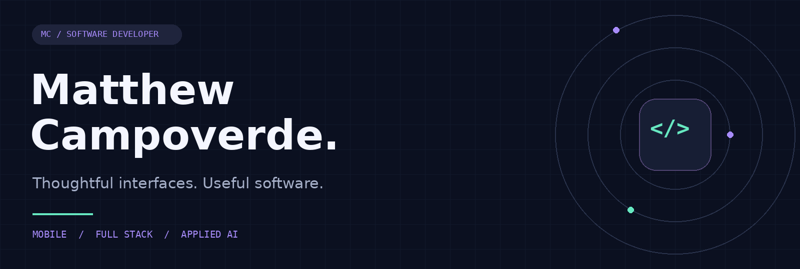
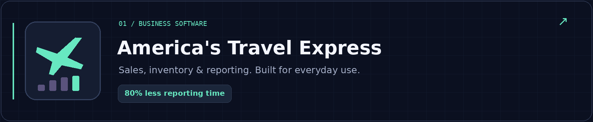
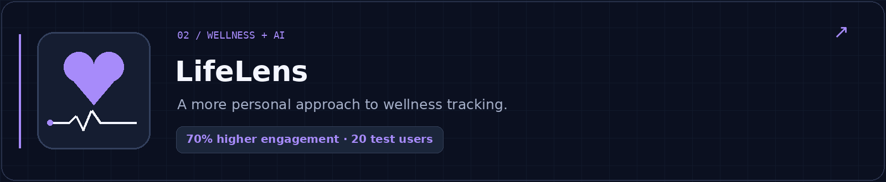
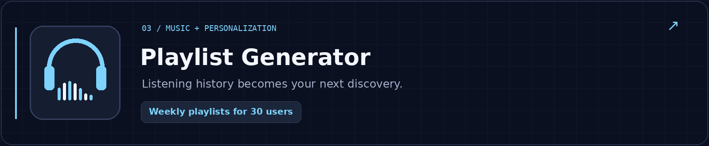
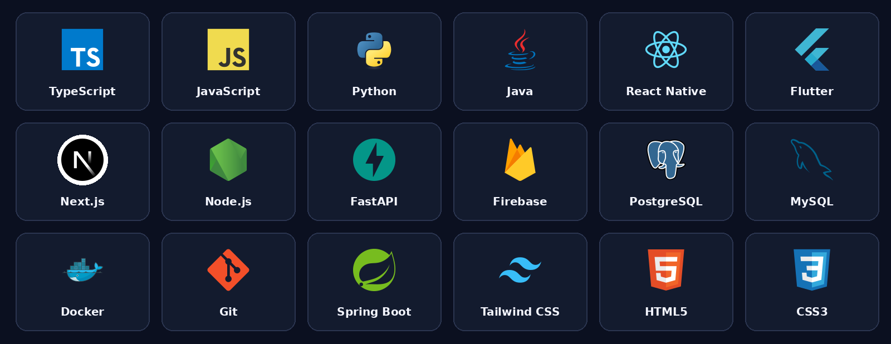
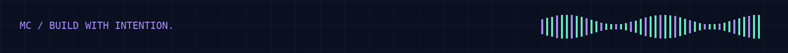

  

  
  &nbsp;
  
  &nbsp;
  

### Good software starts with the people using it.

I'm **Matthew**, a software developer and **M.S. Computer Science student at City College of New York**. I build mobile and full-stack applications, with an interest in interfaces that feel intuitive and AI features that serve a clear purpose.

I've delivered an iOS app used by business staff, collaborated on a wellness platform, and built personalized music recommendations. I also taught Java, Python, and JavaScript at **Lavner Education**—an experience that made me a more thoughtful technical communicator.

  

Delivered a React Native iOS application adopted by staff to manage sales, inventory, and daily revenue. Built authentication and catalog retrieval with Firebase, persistent account-scoped local state, and automated PDF reporting.

**80% less reporting time** · Approximately **4 staff-hours saved per month**

`React Native` `TypeScript` `Firebase` `React Context` `AsyncStorage`

---

Collaborated with a five-person team on a full-stack wellness application. Developed DistilBERT emotion classification and integrated embedding-based retrieval with Weaviate to support relevant wellness guidance. A personalized avatar reflected users' moods and activity.

**70% higher engagement** among **20 test users** after introducing the avatar.

`Flutter` `FastAPI` `Firebase` `Weaviate` `DistilBERT`

[Explore LifeLens →](https://github.com/mcampo0215/lifelens)

---

Built and deployed an application that generated weekly playlists for **30 users** from their Apple Music listening histories. Integrated the Apple Music API with server-side developer-token handling and personalized recommendations of up to **30 tracks**.

`TypeScript` `Node.js` `Apple Music API` `Vercel`

[Explore Playlist Generator →](https://github.com/mcampo0215/AshleyAI-Playlist)

| Area | Technologies |
| :--- | :--- |
| **Languages** | TypeScript · JavaScript · Python · Java · Dart · HTML/CSS |
| **Web & mobile** | Next.js · React Native · Flutter · Expo · Tailwind CSS |
| **Backend** | Node.js · FastAPI · Spring Boot |
| **Data & tools** | PostgreSQL · MySQL · Firebase · Docker · Git |

**City College of New York** — M.S., Computer Science · August 2026–Present  
**New York Institute of Technology** — B.S., Computer Science · September 2022–May 2026

A little more about my background

My coursework spans data structures and algorithms, algorithm analysis, database management, software engineering, web and mobile development, computer architecture, and discrete structures.

At Lavner Education, I led project-based programming instruction and guided students through AI-powered projects using the OpenAI API. I enjoy making technical ideas easier to understand and turning feedback into better software.

---

  <strong>Have something in mind? Let's build it.</strong> 
  <a href="mailto:mcampo1502@gmail.com">Email</a> &nbsp; / &nbsp;
  <a href="https://www.linkedin.com/in/matthew-campoverde-aa4bb4256/">LinkedIn</a>

  

